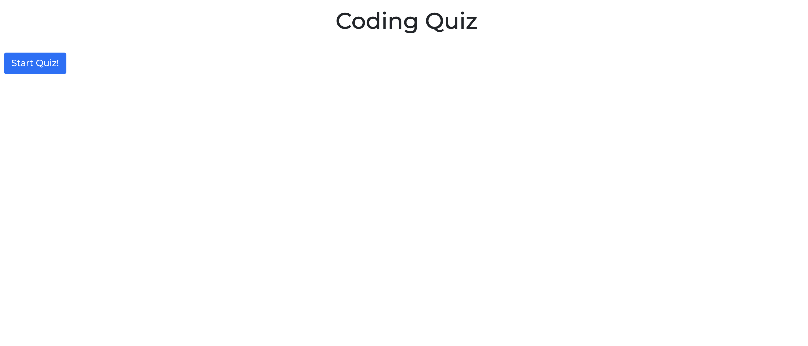
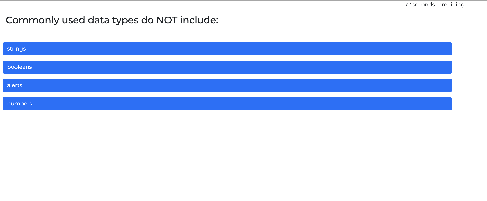
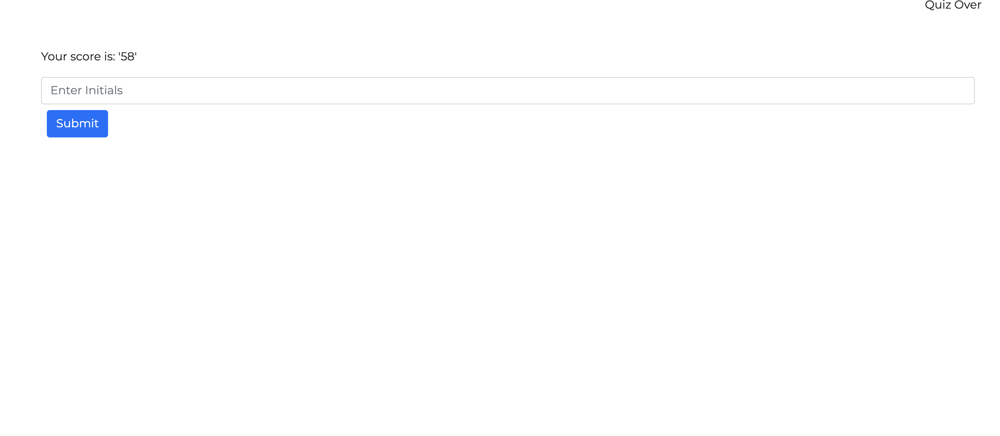
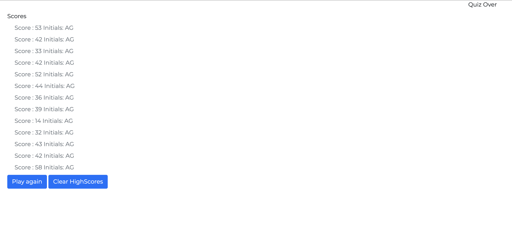

# codingQuizHomework4

## Description
This application is an interactive coding quiz which when the user clicks the start button, a timer starts for 75 seconds and they are given a question. Once they answer that question they are presented with another question. There are a total of 5 questions. When a question is answered incorrectly, the timer subtracts 10 seconds. When all the questions have been answered or if the user runs out of time, then the game is over. When the game is over they enter their own initials are taken to a score page where they can see the locally saved high scores. They then have the option to play again or to reset the high scores. 

## Screenshots

## Link to deployed application.
https://alexgoldman98.github.io/codingQuizHomework4/
